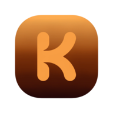

<p align="center">
  
</p>

<h1 align="center">KodaHosting</h1>

<p align="center">
  <b>Run a Minecraft server directly on your Android phone: your hardware, your world, your rules.</b><br>
  Java &amp; Bedrock crossplay · one-tap modpacks · live console · 100% open source
</p>

<p align="center">
  <a href="https://github.com/libredroid-project/KodaNetwork/releases/latest"></a>
  <a href="https://github.com/libredroid-project/KodaNetwork/releases"></a>
  <a href="https://github.com/libredroid-project/KodaNetwork/blob/main/LICENSE"></a>
  
</p>

---

## What is KodaHosting?

KodaHosting is an Android app that hosts real Minecraft servers on your own phone or tablet. No PC, no rented VPS, no monthly costs. Your worlds and files stay on your device, friends join through a built-in tunnel so your home IP stays private, and the app handles everything that normally requires Linux knowledge: server downloads, Java runtimes, port handling, plugin and mod installation, crash diagnosis.

Think of it as a full server control panel in your pocket: create a server, press START, share the join address.

## Features

- **100% open source** (GPL-3.0), code and licenses fully visible in the app
- **All major server software**: Paper, Purpur, Folia, Vanilla, Forge, Fabric, NeoForge, plus PumpkinMC (native Rust server that boots in under a second with built-in Bedrock support)
- **Bedrock crossplay**: Geyser/Floodgate auto-installed for Java servers, built into Pumpkin
- **Modpacks made easy**: search Modrinth in-app and install Fabric modpacks with dependency and checksum handling
- **Per-server Java**: JRE 8/17/21/25 downloaded on demand, auto-selected per software
- **Live console**: colored log output, real command input, quick commands
- **File manager**: browse, edit, import and export every server file, with protected managed keys
- **Network budgets**: rules like "1 GB mobile data per week" with warn, stop and block actions and a live traffic dashboard
- **Player tools**: live player list, heal/feed/kick/ban, stats and inventory viewer
- **Multi-language**: English, German, Chinese
- ...and a lot more, just try it out

## Requirements

| | |
|---|---|
| Device | Android 11 or newer (arm64 CPU) |
| RAM | at least 4 GB |
| Internet | required for tunnel and player connections |

## Download

Grab the latest APK from [Releases](https://github.com/libredroid-project/KodaNetwork/releases/latest) and install it (allow "install unknown apps" for your browser). Documentation is available in the app and on [host.kodanetwork.eu](https://host.kodanetwork.eu).

## Building from source

```bash
# requires JDK 21 (Gradle 8.9) and Android SDK with NDK r27
cp app/src/main/cpp/secrets_local.h.example app/src/main/cpp/secrets_local.h
./gradlew :app:assembleDebug
# signed release bundle (store credentials required):
./gradlew :app:bundleRelease -PKEYSTORE_PW=... -PKEY_PW=...
```

Note: `secrets_local.h` is git-ignored. The placeholder from the example file is enough to compile; only the optional AI assistant needs a real value, and the tunnel token is fetched from the server at runtime anyway.

## Project structure

```
app/                  The Android app (UI, server service, tunnel, security)
app/src/main/cpp/     Native security layer (PraetorSecurity)
KodaDash/             On-device web console (served locally, tunneled to players)
supabase/             Edge functions + security SQL (device-token model)
```

Bundled server-side plugins (Lobby, KodaDash, Transfer) ship as compiled jars inside the app assets.

## How the cloud connection works

The app is designed so your server files never leave your phone. The cloud parts do three jobs:

1. **Supabase** (control plane): account login, server list, port allocation, DNS links and support tickets. The app talks to it through RPC functions protected by a per-device token that the app receives on first start.
2. **Edge Functions**: short serverless functions for port allocation, DNS records, email codes and tunnel credentials. Secrets (DNS API, mail, tunnel token) live as environment secrets, never in the app.
3. **frps relay** (data plane): an frp server on a simple VPS. Each running server opens an authenticated tunnel so players can join without exposing your home IP.

## Self-hosting: use your own Supabase and frps

The public source contains no server addresses or keys. Everything instance specific lives in `app/src/main/cpp/secrets_local.h` (git-ignored). To run your own backend:

1. **Supabase**: create a free project, then run the SQL files in `supabase/` (schema, security fixes, RPCs) in the SQL editor and deploy the edge functions from `supabase/functions/` (set their env secrets: `IONOS_API_PREFIX`, `IONOS_API_SECRET`, `RESEND_API_KEY`, `FRP_TOKEN`).
2. **frps**: rent any small VPS, install [frp](https://github.com/fatedier/frp), open ports 7000 plus 30000-59999 and use the hardened `frps.toml` from this repo's scripts as a template.
3. **secrets_local.h**: copy `secrets_local.h.example`, encode your values (each char XOR 0x4B) and fill `SUPABASE_URL_OBF`, `SUPABASE_ANON_OBF`, `BORE_HOST_OBF`, or use a generator script of your choice.
4. Build, done. The official KodaHosting app uses the same mechanism with its own (private) configuration.

## Legal

- **License:** [GNU GPL v3](LICENSE), dual-licensed under LOPL v1.0 Preview and a Commercial License
- Privacy Policy, Terms of Service and Imprint are bundled in the app (Licenses tab) and available at [host.kodanetwork.eu](https://host.kodanetwork.eu)
- KodaHosting is not an official Minecraft product and is not approved by or associated with Mojang or Microsoft.
- The optional "Ask AI" feature sends log excerpts to OpenRouter (rotating free models) only when explicitly tapped and consented; see the in-app Privacy Policy.

## Support

Found a bug or a crash the analyzer does not recognize? Open an [issue](https://github.com/libredroid-project/KodaNetwork/issues) and include the console log (Files, logs/latest.log).
